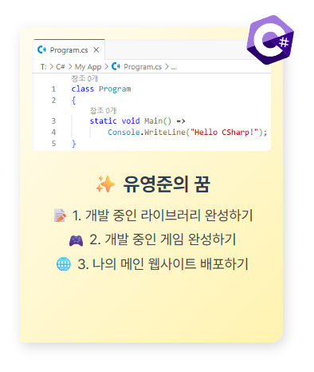
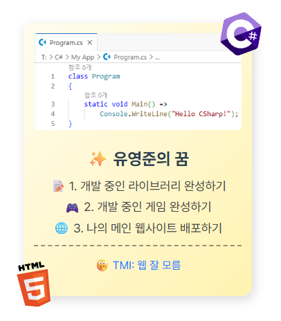

```html
<!DOCTYPE html>
<html lang="ko">

<head>
    <meta charset="UTF-8">
    <title>내 버킷리스트 카드</title>
    <style>
        /* 기본 카드 디자인 (자유롭게 수정 가능) */
        .card {
            width: 300px;
            margin: 50px auto;
            background: linear-gradient(135deg, #fffcf0 0%, #fff3b0 100%);
            padding: 15px 15px 35px 15px;
            border-radius: 2px 2px 15px 5px;
            box-shadow: 3px 5px 15px rgba(0, 0, 0, 0.15);
            /* 배지의 기준점이 되기 위한 필수 속성 */
            position: relative;

            text-align: center;
        }

        .card img {
            width: 100%;
            height: 140px;
            object-fit: cover;
            border-radius: 5px;
        }

        .card h2 {
            color: #2c3e50;
            font-size: 1.5rem;
            margin-bottom: 10px;
        }

        .card p {
            color: #444;
            font-size: 1.1rem;
            line-height: 0.75;
        }

        .card .line {
            border-top-style: dashed;
            border-top-width: 0.15em;
            border-top-color: #00000067;
            margin-top: 1em;
            margin-bottom: 1em;
        }

        /* 1. 배지 (absolute) 관련 CSS를 작성하세요 */
        .card .badge#csharp {
            position: absolute;

            top: -1em;
            right: -1em;

            rotate: 10deg;

            width: 4em;
            height: 4em;
            object-fit: contain;
        }

        .card .badge#html5 {
            position: absolute;

            bottom: -1em;
            left: -1em;

            rotate: -10deg;

            width: 4em;
            height: 4em;
            object-fit: contain;
        }

        /* 2. 비밀 메모 (visibility) 및 hover 효과 관련 CSS를 작성하세요 */
        .card .secret-memo {
            color: rgb(37, 124, 255);

            opacity: 0;
            transition: opacity 0.1s linear;
        }

        .card:hover .secret-memo {
            opacity: 1;
        }
    </style>
</head>

<body>

    <div class="card">
        

        <h2>✨ 유영준의 꿈</h2>
        <p>📝 1. 개발 중인 라이브러리 완성하기</p>
        <p>🎮 2. 개발 중인 게임 완성하기</p>
        <p>🌐 3. 나의 메인 웹사이트 배포하기</p>

        <div class="secret-memo">
            
            <div class="line"></div>
            🤫 TMI: 웹 잘 모름
        </div>

        

    </div>
</body>

</html>
```


